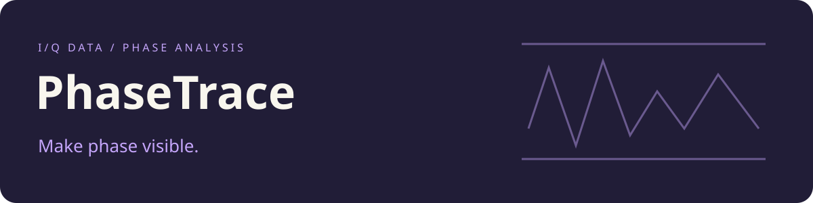

# PhaseTrace

**Development history:** Developed locally before publication. These repositories were uploaded together, so their GitHub publication dates do not indicate when development began.



Experiment scripts, figures and dataset recipes for analyzing phase-modulated electromagnetic measurements.

## Explore the workspace

| Location | Purpose |
| --- | --- |
| `expe/` | Experiment-specific analysis scripts, stored arrays and figures |
| `sets/` | Dataset definitions and supporting files |
| `src/` | Dataset utility scripts |
| `mods/` | Pinned external firmware, analysis and recording modules |
| [Reproduction guide](docs/2025-01-23_tches-artifact/README.md) | Existing container workflow and dataset references |

## Source checkout

```sh
git clone https://github.com/nazeeh111/PhaseTrace.git
cd PhaseTrace
git submodule update --init --recursive
```

The three external modules retain their original URLs and exact commit pins so that existing experiments resolve the same implementations. Their licenses and interfaces are independent of this repository's presentation.

The reproduction guide preserves its `phasesca` container and directory names for compatibility. Complete reproduction requires external datasets, some measured in tens of gigabytes, plus the specified analysis environment. The publication checks did not download these datasets or initialize device firmware.

[Preservation and verification](COMPATIBILITY.md) distinguishes source checks from experimental reproduction.

## Source terms

First-party source is available under the [MIT license](LICENSE). Separate bundled components and external modules retain their own terms.
